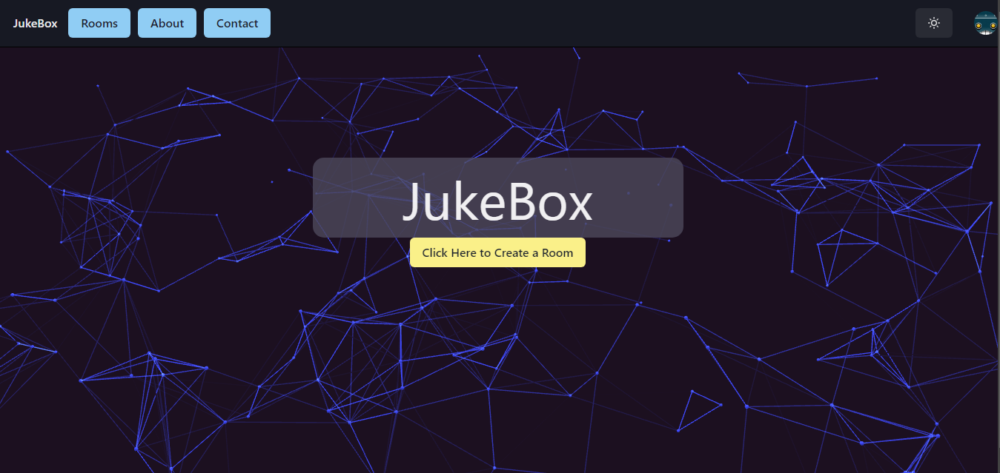

# Jukebox
  
  

## TABLE OF CONTENTS:

* [Description](#description)

* [Tools Used](#tools)

* [Installation guide](#installation) 

* [Usage Info](#usage) 

* [Contribution Guidelines](#contribution) 

* [Testing Instructions](#testing) 

* [Questions](#questions)

* [Credits](#credit)

* [License](#license)

## DESCRIPTION:

This is the ReadMe for Matty Lawhorn, Thomas Le, Juan Gonzales, Andrew Johnson's project #3 titled: Jukebox   

This is the final group project for the UT Austin Full-Stack Web Development Fall 2022 Bootcamp. The challenge was to use a MERN stack to provide a reactive and persistant web app.  

After making an account and signing in, users can either join any public lobby or create their own. In that lobby, users can add YouTube videos to a queue which everyone can watch. 

## TOOLS:

Our app has React.js (built in a development environment by Vite) on the front end, has Express with Apollo Client and GraphQL attached to a MongoDB database, and uses Node.js on the backend. 

* React
* Vite
* MERN stack
* MongoDB
* Apollo Client and GraphQL
* Express

## INSTALLATION:

Go to our Heroku Deployment (coming soon)  

## USAGE:

Join any public lobby or make an account to make your own.  

## CONTRIBUTION:

Sorry, this project is privately maintained.  

## TESTING:

Thank you, but no testing is needed at this time.  

## QUESTIONS:

If you have any questions,  
click on our name's below to find our GitHub profiles.  

or send us an email me here: fake@notreal.com  

## CREDIT:

This project was made in 2022 by  

  <a target="_blank" rel="noopener noreferrer" href="https://github.com/Chueg">Andrew Johnson</a>   
  <a target="_blank" rel="noopener noreferrer" href="https://github.com/JuaGon653">Juan Gonzales</a>   
  <a target="_blank" rel="noopener noreferrer" href="https://github.com/Lawhornmatt">Matthew Lawhorn</a>  
  <a target="_blank" rel="noopener noreferrer" href="https://github.com/Thomasple13">Thomas Le</a>   

Special Thanks to:  

## LICENSE:

This program is copyrighted under the MIT open source license.

Copyright 2022 Matty Lawhorn, Thomas Le, Juan Gonzales, Andrew Johnson

    Permission is hereby granted, free of charge, to any person obtaining a copy of this software and associated documentation files (the "Software"), to deal in the Software without restriction, including without limitation the rights to use, copy, modify, merge, publish, distribute, sublicense, and/or sell copies of the Software, and to permit persons to whom the Software is furnished to do so, subject to the following conditions:
    
    The above copyright notice and this permission notice shall be included in all copies or substantial portions of the Software.
    
    THE SOFTWARE IS PROVIDED "AS IS", WITHOUT WARRANTY OF ANY KIND, EXPRESS OR IMPLIED, INCLUDING BUT NOT LIMITED TO THE WARRANTIES OF MERCHANTABILITY, FITNESS FOR A PARTICULAR PURPOSE AND NONINFRINGEMENT. IN NO EVENT SHALL THE AUTHORS OR COPYRIGHT HOLDERS BE LIABLE FOR ANY CLAIM, DAMAGES OR OTHER LIABILITY, WHETHER IN AN ACTION OF CONTRACT, TORT OR OTHERWISE, ARISING FROM, OUT OF OR IN CONNECTION WITH THE SOFTWARE OR THE USE OR OTHER DEALINGS IN THE SOFTWARE.

[Further license information can be found here.](https://opensource.org/licenses/MIT)

